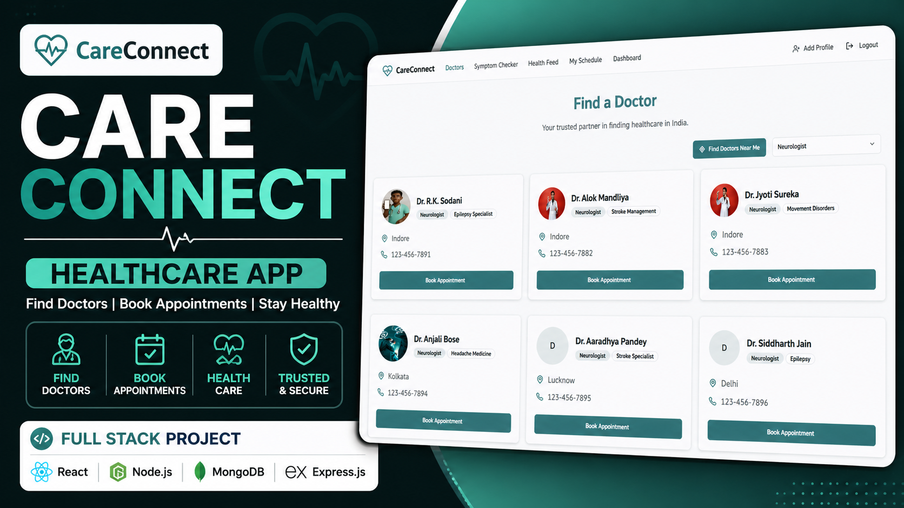
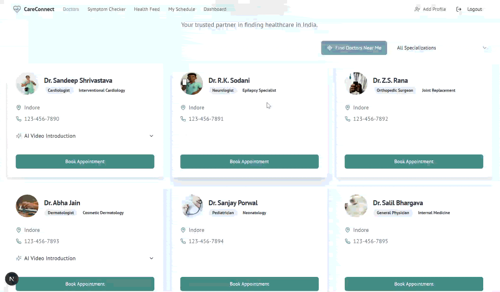

<div align="center">

# CareConnect

### Full Stack Healthcare App for Doctor Discovery & Appointment Booking

[](https://youtu.be/ZNoJAdn9ej4)

**[Watch Demo](https://youtu.be/ZNoJAdn9ej4)**



</div>

## Overview

CareConnect is a healthcare web app that helps users discover doctors, filter by specialization, find nearby doctors, book appointments, manage schedules, read health updates, and use an AI-assisted symptom checker.

The project is built to be clean, responsive, and portfolio-ready for recruiters and reviewers.

## Preview

<div align="center">



</div>

## Features

- Doctor discovery with specialization filtering
- Nearby doctor search using browser geolocation
- Appointment booking and schedule management
- Dashboard with user and appointment summaries
- AI-assisted symptom checker with local fallback recommendations
- Health feed and responsive UI
- Clean reusable component structure

## Tech Stack

- React
- Next.js
- TypeScript
- Tailwind CSS
- Radix UI
- Genkit / Gemini AI
- Node.js
- MongoDB-ready environment configuration

## Setup

```bash
git clone https://github.com/om-bhadauria/Project.1.-CareConnect-APP.git
cd Project.1.-CareConnect-APP
npm install
```

Create your local environment file:

```bash
cp .env.example .env.local
```

Start the development server:

```bash
npm run dev
```

Open:

```txt
http://localhost:9002
```

## Future

- MongoDB-backed persistent doctors and appointments
- Authentication with protected user accounts
- Doctor admin dashboard
- Payment and appointment confirmation workflow
- Production deployment with environment-based configuration

## Contact

GitHub: [om-bhadauria](https://github.com/om-bhadauria)

Demo: [CareConnect YouTube Demo](https://youtu.be/ZNoJAdn9ej4)
